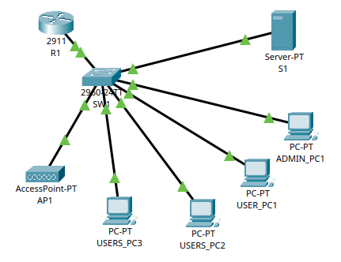
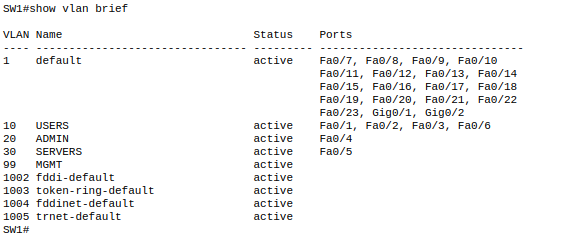
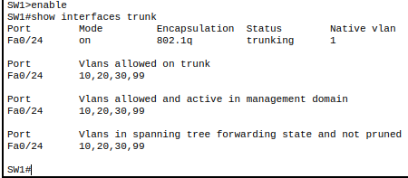
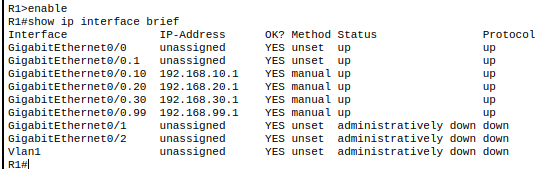

# <u> VLAN-Based Enterprise Network Design </u>

## Project Overview

This project documents the design, implementation, and security hardening of a small enterprise-style network built using Cisco Packet Tracer. The focus of the lab was to apply real-world networking and security concepts including VLAN segmentation, inter-VLAN routing, access control, and secure device management.

Rather than only achieving connectivity, this project emphasizes verification, troubleshooting, and defense-in-depth principles commonly used in enterprise environments.

---

## Network Topology and Design

### Devices Used
- Cisco 2911 Router
- Cisco 2960 Layer 2 Switch
- Admin PC
- User PCs
- Server
- Wireless Access Point

The network uses a centralized access switch with a single trunk uplink to the router. End devices connect to access ports on the switch, while inter-VLAN communication is handled by the router.

---

## VLAN Segmentation

### VLAN Structure
- VLAN 10: Users
- VLAN 20: Admins
- VLAN 30: Servers
- VLAN 99: Management

VLANs were implemented to logically separate traffic, reduce broadcast domains, and limit lateral movement between different device roles.

Each end device was assigned to an access port mapped to its appropriate VLAN.

---

## Trunking Configuration

An 802.1Q trunk was configured between the switch and the router to carry multiple VLANs over a single physical link. Only required VLANs were allowed on the trunk.

During implementation, a misconfiguration where the trunk port was incorrectly set as an access port was identified and corrected, reinforcing the importance of trunk verification.

---

## Inter-VLAN Routing

Inter-VLAN routing was implemented using a router-on-a-stick architecture. Subinterfaces were created on the router, each associated with a specific VLAN and assigned an IP address to act as the default gateway.

This allowed controlled communication between VLANs while maintaining logical segmentation.

---

## IP Addressing and Gateways

Each VLAN was assigned its own IP subnet. End devices were configured with:
- A static IP address
- Correct subnet mask
- Default gateway pointing to the router subinterface for their VLAN

This configuration enabled both intra-VLAN communication and routed traffic between VLANs.

<!-- Screenshot: Example PC IP configuration -->

---

## Verification and Troubleshooting

Network functionality was verified using standard Cisco diagnostic commands including:
- show vlan
- show interfaces trunk
- show ip route
- ping

Successful verification confirmed correct VLAN membership, trunk operation, routing, and basic connectivity. Troubleshooting steps were used throughout the project to identify and resolve configuration issues.

<!-- Screenshot: Successful ping tests between VLANs -->

---

## Access Control Lists

Access Control Lists were implemented on the router to enforce least-privilege access between VLANs. ACLs were applied inbound on router subinterfaces to control traffic before routing decisions were made.

This ensured that user devices could not access restricted administrative or server resources unless explicitly permitted.

<!-- Screenshot: ACL configuration and application -->

---

## Management Plane Hardening

Network device management was secured by:
- Disabling Telnet
- Enabling SSH version 2
- Creating a local administrative user
- Restricting VTY access to the Admin VLAN only

Management traffic was isolated using a dedicated management VLAN to further reduce risk.

<!-- Screenshot: SSH and VTY configuration -->

---

## Switch Hardening

Unused switch access ports were administratively disabled to reduce the attack surface and prevent unauthorized device connections. This reflects standard enterprise switch hardening practices.

<!-- Screenshot: show interface status showing disabled ports -->

---

## Security Concepts Demonstrated

- Network segmentation
- Inter-VLAN routing
- Least-privilege access control
- Management plane security
- Attack surface reduction
- Defense-in-depth

---

## Conclusion

This project demonstrates a practical understanding of enterprise networking and security fundamentals. It reflects hands-on experience with designing, securing, and verifying a segmented network using industry-standard techniques applicable to entry-level cybersecurity and networking roles.
