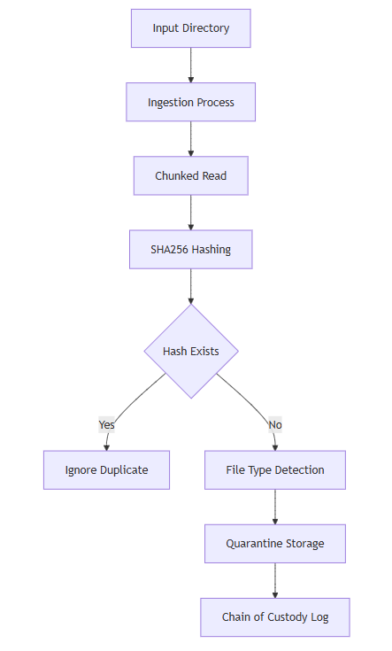
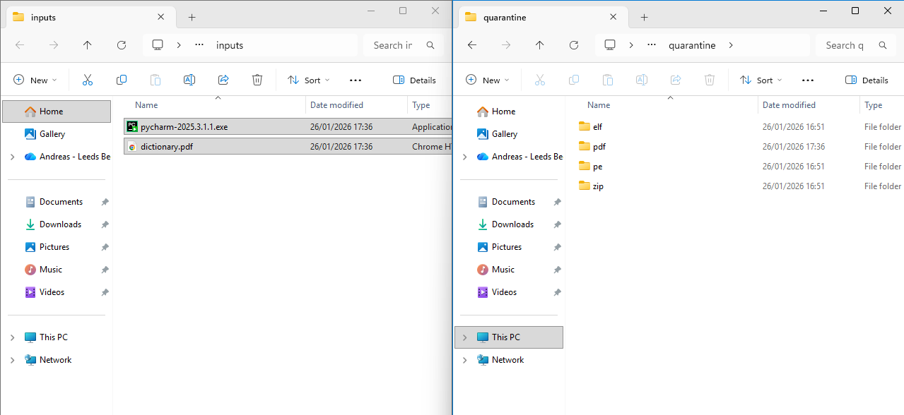
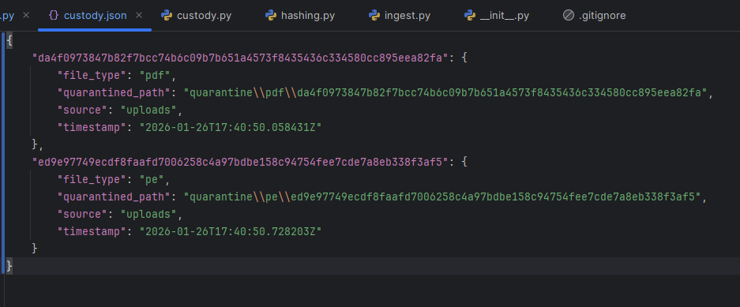

# <u> Malware Pipeline Phase 1 </u>

## 1. Defining the Threat Model

This program assumes all input files are untrusted and potentially malicious

### Assumptions
- Input files may attempt to execute, evade detection, or consume excessive resources
- Filenames, extensions, and metadata cannot be trusted
- Identical malware samples may be submitted multiple times

### Primary Threats
- Accidental execution during ingestion
- File tampering or replacement after submission
- Resource exhaustion through large or malformed files
- File-type masquerading (e.g., renamed executables)

### Trust Boundaries
- External input directory → ingestion process
- Ingestion process → quarantine storage

### Design Implications
- Files are hashed before storage to ensure integrity and enable deduplication
- Files are read in fixed-size chunks to prevent memory exhaustion
- File type detection is based on magic bytes rather than extensions
- Quarantined files are stored with execution disabled and isolated from analysis logic

The threat model informed all ingestion and quarantine decisions to ensure untrusted input could not impact system integrity or analyst safety.

## 2. Creating Ingestion Workflow Diagram

### Input directory

- The purpose of the input directory is to act as a boundary where untrusted files can enter the pipeline in a controlled way
- This makes it easier to contain because all files that are in that directory are treated as malicious by default
- Files are read-only and under no circumstances are executed. The directory contents are iterated over without executing anything

### Cryptographic Hashing Using SHA-256

- This is used a unique file indetifier for each file in the pipeline and is later used in deduplication to prevent unecessary file processing and computer resources being used
- The unique identifier ensures file integrity (file tampering can be recognised) and enables chain-of-custody tracking
- Files in the input directory are read in fixed-size chunks and hashed using the haslib library

### File type detection Using Magic Bye 

- I needed a system that did not rely on file extensions because it is common that malware is hidden through means of extension spoofing
- So i used magic bytes to determine the real file type by comparing them against a set of known signatures

### Quarantine Storage

- This purpose of this is to isolate samples from the host system to further reduce the attack surface
- The security rationale behind this as preventing drastic effects of accidental execution or lateral movement on the host system
- Files are first named by their unique hash value and stored in a directory with no executing permissions that is outside of the input directory

Screenshot of the initial test setup and files:

Screenshot of the files after the ingestion program was run:

### Chain of Custody Log

- This was made to keep an auditable record of the file ingested in a well structured json file
- I wanted a high degree of reproducibility and forensic integrity.
- The json file can only be interacted with via set functions in the custody.py module. They have expected inputs and outputs so the attack surface is again minimised

Screenshot of chain of custody log from phase 1 test:

## 3. Testing and Validation

- Testing Case 1: Clean file ingestion
  - Objective: Verify that a new file is safely ingested and quarantined
  - Expected Result: File is hashed, renamed, move to quarantine, and logged in custody metadata

