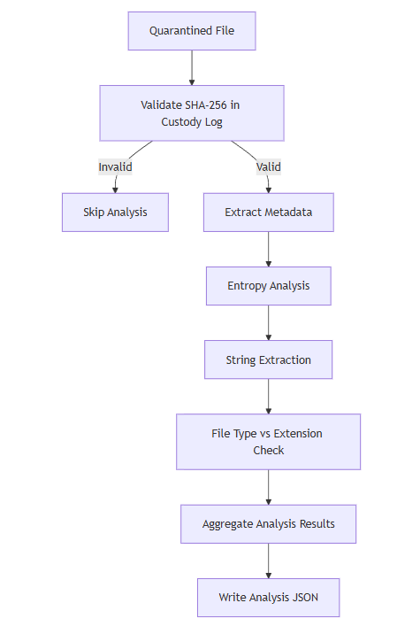
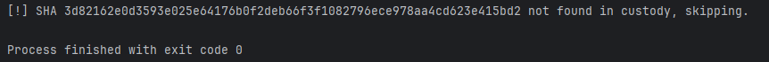
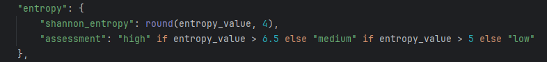
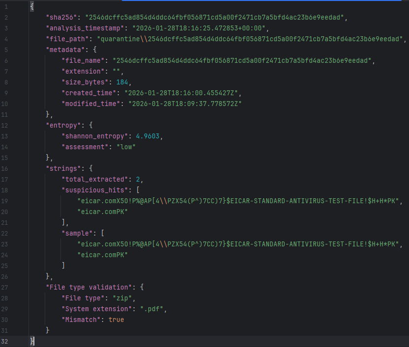

# <u> Malware Pipeline Phase 2 </u>

## 1. Static Analysis Objectives

With ingestion, quarantine, and chain-of-custody established in Phase 1, Phase 2 focuses on **static analysis of quarantined samples**.  
All analysis is performed **without execution** to preserve host safety and forensic integrity.

### Goals
- Extract structural and contextual information from files
- Identify static indicators of suspicious or malicious content
- Enrich chain-of-custody records with analysis artifacts
- Maintain strict separation between untrusted samples and analysis logic

### Constraints
- No file execution under any circumstances
- All files treated as hostile regardless of type
- Analysis must be deterministic and reproducible

 

## 2. Static Analysis Workflow

### Analysis Directory

- A dedicated analysis directory stores results separately from quarantined samples
- Quarantined files remain immutable after ingestion
- Each analysis result is stored as a JSON file named by the sample’s SHA-256 hash

### Custody Validation

- Each file is validated against the chain-of-custody log before analysis
- Files missing custody entries are skipped
- This prevents analysis of orphaned or tampered samples

 

## 3. Metadata Extraction

### Extracted Metadata Fields

- Original filename
- File extension
- File size in bytes
- Creation timestamp
- Modification timestamp

### Design Rationale
- Metadata provides contextual information without inspecting file contents
- All timestamps are normalized to UTC
- Metadata extraction occurs prior to deeper content analysis

<!-- INSERT METADATA JSON EXAMPLE HERE -->

 

## 4. Entropy Analysis

### Purpose

- Measure randomness across file contents
- Identify packed, encrypted, or obfuscated files

### Methodology

- Files are read in fixed-size chunks to control memory usage
- Byte frequency distributions are computed
- Shannon entropy is calculated across the entire file

### Interpretation

- Low entropy: plaintext or highly structured content
- Medium entropy: compressed or mixed content
- High entropy: encrypted or packed data

 

## 5. String Extraction

### Purpose

- Extract readable ASCII strings without execution
- Surface embedded indicators such as URLs, commands, or file paths

### Extraction Logic

- Files are scanned byte-by-byte
- Printable ASCII sequences above a minimum length are retained
- Output is capped to prevent log flooding

### Output Structure

- Total number of extracted strings
- Subset of suspicious matches
- Sample preview for analyst inspection

<!-- INSERT STRING EXTRACTION SAMPLE HERE -->

 

## 6. File Type vs Extension Mismatch Detection

### Motivation

- Malware commonly disguises itself using misleading extensions
- File extensions alone cannot be trusted

### Detection Strategy

- Detected file type (via magic bytes) is compared to the system file extension
- Any mismatch is flagged during analysis

<!-- INSERT FILE TYPE MISMATCH EXAMPLE HERE -->

 

## 7. Analysis Output and Logging

- Each analysis result is written to an immutable JSON log
- Logs are keyed by SHA-256 for traceability
- Analysis artifacts are directly linked to custody records

This preserves forensic integrity and enables reproducibility.

 

# <u> Phase 2 Conclusion </u>

Phase 2 enriches quarantined samples through static analysis without execution. By combining metadata extraction, entropy measurement, string analysis, and file-type mismatch detection, the pipeline now produces actionable intelligence while maintaining strict safety boundaries.

With Phases 1 and 2 complete, the system is prepared for **dynamic analysis, correlation, and detection logic** in subsequent phases.

## [back](../malware_pipeline.md)
